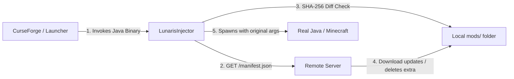

# 🌙 LunarisInjector

**LunarisInjector** is a lightweight, zero-dependency synchronization engine and pre-launch interceptor designed to sit directly between **CurseForge** (or any Minecraft launcher) and **Minecraft**.

When the player clicks **"Play"** in CurseForge, LunarisInjector intercepts the launch sequence, verifies all files and hashes in the instance (e.g. `mods/`, `config/`) against your remote server, downloads additions/updates, removes obsolete files, and then seamlessly hands execution over to the real Java runtime with the original Minecraft arguments.

---

## ⚡ Key Features

- **Zero-Click for Players**: Once installed, players just press **"Play"** in CurseForge as usual. Updates, additions, and deletions happen automatically before the game boots.
- **Fast Multi-Threaded Hashing & Downloads**: Uses SHA-256 with parallel download workers and atomic replacements (`.tmp` verification -> atomic rename) to avoid corrupt mod files.
- **Offline Safe**: If your sync server is offline or unreachable, Lunaris logs a warning and boots Minecraft anyway with existing local files so players aren't locked out.
- **Built-in Auto-Updating Server**: Run `lunaris server --dir ./modpack` anywhere to instantly host files with real-time hash caching and a clean web dashboard.
- **Static Hosting Friendly**: If you prefer Nginx, Apache, Caddy, Cloudflare R2, AWS S3, or GitHub Pages, simply run `lunaris generate` to create `manifest.json`.
- **Cross-Platform Single Binaries**: Pure Go with zero runtime dependencies. Standalone `.exe` for Windows, single binary for Linux and macOS.

---

## 🏗 Architecture Overview



---

## 🚀 Quick Start Guide

### 1. Server Setup (For Modpack Authors)

You have two options for hosting files:

#### Option A: Built-in Dynamic Server (Easiest)
Create a folder containing your `mods/` (and optionally `config/`):
```bash
# Start the sync server on port 8080
./lunaris server --dir ./my-modpack --port 8080
```
- Automatically monitors the directory and updates hashes when files change.
- Serves `http://<your-ip>:8080/manifest.json`.
- Web Dashboard accessible at `http://<your-ip>:8080/`.

#### Option B: Static Web Hosting (Nginx, S3, Cloudflare R2, GitHub)
Generate a `manifest.json` inside your modpack directory:
```bash
./lunaris generate --dir ./my-modpack
```
Then host the directory using any standard web server.

---

### 2. Client Setup (For Players)

#### Method 1: Automatic Interactive Installer
Run the installer from your terminal or command prompt:
```bash
# On Linux / macOS
./lunaris install

# On Windows
lunaris.exe install
```
The installer will:
1. Scan and detect installed CurseForge, Vanilla Minecraft, and Prism profiles.
2. Ask you to select your modpack profile.
3. Prompt for the Sync Server URL (e.g. `http://your-server-ip:8080`).
4. Auto-detect your real Java path and write `lunaris.json` into the instance directory.
5. Hook into the profile configuration.

#### Method 2: Manual CurseForge Configuration
If you prefer manual setup:
1. Copy `lunaris.exe` (Windows) or `lunaris` (Linux) to any permanent folder (e.g. `C:\Tools\Lunaris\lunaris.exe`).
2. Inside your CurseForge instance folder (Right-click instance in CurseForge -> **Open Folder**), create `lunaris.json`:
   ```json
   {
     "server_url": "http://your-server-ip:8080",
     "real_java_path": "",
     "sync_dirs": ["mods"],
     "delete_extra": true,
     "offline_launch": true,
     "timeout_sec": 10
   }
   ```
   *(Leaving `real_java_path` empty will let Lunaris auto-detect your system/launcher Java).*
3. In CurseForge:
   - Click the **three dots (...)** on your modpack profile -> **Profile Options**.
   - Check **"Java Executable"** or configure the Java path to point to `lunaris.exe` (or `lunaris`).

---

## ⚙️ Configuration Reference (`lunaris.json`)

`lunaris.json` resides directly inside the instance folder:

| Key | Type | Default | Description |
|---|---|---|---|
| `server_url` | string | `"http://localhost:8080"` | Remote server base URL hosting `manifest.json` and files. |
| `real_java_path` | string | `""` | Absolute path to the real `javaw.exe` / `java`. If empty, automatically discovers it from Minecraft Launcher runtimes or system PATH. |
| `sync_dirs` | string[] | `["mods"]` | Relative directories to synchronize (e.g. `["mods", "config"]`). |
| `delete_extra` | bool | `true` | When `true`, removes any local file in `sync_dirs` that is not present in the remote manifest. |
| `ignore_files` | string[] | `[]` | Glob patterns for files to keep and ignore (e.g. `["*optifine*", "custom-settings.json"]`). |
| `offline_launch` | bool | `true` | If `true`, launches Minecraft even if the server is unreachable. |
| `timeout_sec` | int | `10` | HTTP timeout in seconds for server queries and downloads. |

---

## 🛠 CLI Commands

```bash
lunaris install            # Interactive or automated installer
lunaris uninstall          # Reverts instance back to original state
lunaris server             # Starts the built-in HTTP sync server with live dashboard
lunaris generate           # Generates static manifest.json in a folder
lunaris verify             # Compares instance against server without launching game
lunaris instances          # Lists detected CurseForge and Minecraft instances
lunaris run [args...]      # Manually runs the injector wrapper with arguments
```

---

## 📦 Building from Source

Prerequisites: [Go 1.22+](https://go.dev/)

```bash
# Build binary for current platform
make build

# Cross-compile for Linux, Windows (.exe), and macOS (arm64 + x86_64)
make build-all

# Run test suite
make test
```

Compiled binaries will be in the `dist/` directory.
